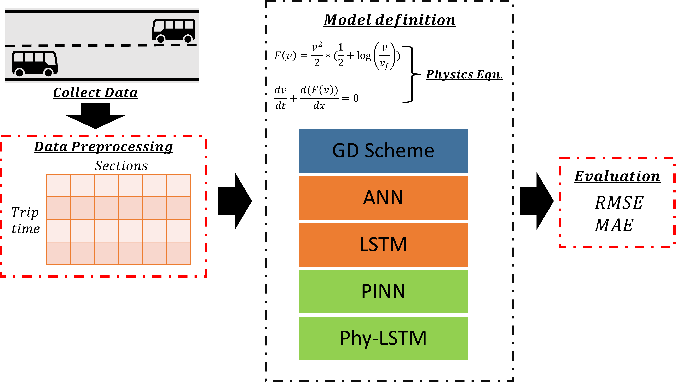
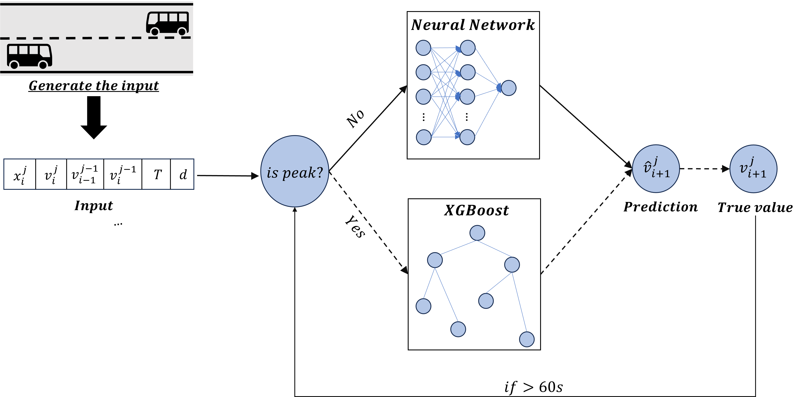

# Bus Travel Time Prediction

Physics-informed and adaptive machine learning for bus travel time prediction on 100m road sections.



## Highlights

- Physics-informed learning with Aw-Rascle PDE regularization.
- Unified framework for ANN, PINN, LSTM, Phy-LSTM, and XGBoost.
- Adaptive generalist-specialist routing for peak-delay handling.
- Config-driven train/tune/evaluate workflow.

## Why This Project

- Predict section-level bus travel time under highly dynamic urban traffic.
- Compare pure data-driven, pure physics, and physics-informed models.
- Solve rare peak-delay underprediction using an adaptive generalist-specialist architecture.

## Model Stack

| Model | Type | Description |
|-------|------|-------------|
| **ANN** | Tabular NN | Feedforward network with BatchNorm + Dropout |
| **PINN** | Tabular NN | Physics-informed NN with Aw-Rascle residual regularization |
| **LSTM** | Sequential | LSTM + context features, trained with MSE only |
| **Phy-LSTM** | Sequential | LSTM + context features + physics residual |
| **XGBoost** | Gradient boosting | Tabular specialist model for hard peak regimes |
| **Adaptive Hybrid** | Routing framework | Uses Phy-LSTM by default and switches to XGBoost on peak-triggered sections |

## Adaptive Architecture



## Project Layout

```text
bus-tt-prediction/
├── configs/                  # Train/tune YAMLs
├── data/sample/              # Sample datasets
├── scripts/                  # train.py, tune.py, evaluate.py, latency_check.py
├── src/bus_tt/
│   ├── data/                 # IO, features, splits, dataset wrappers
│   ├── models/               # ANN, PINN, LSTM/Phy-LSTM, XGBoost, hybrid router
│   ├── losses/               # Physics and focal loss
│   ├── train/                # Training loops + registry
│   ├── tune/                 # Optuna tuning and search spaces
│   └── eval/                 # Metrics, comparisons, latency
└── README.md
```

## Quick Start

```bash
# Install
pip install -e .

# Train a model
python scripts/train.py --config configs/train/phylstm.yaml

# Tune hyperparameters
python scripts/tune.py --config configs/tune/phylstm.yaml

# Evaluate
python scripts/evaluate.py --config configs/train/phylstm.yaml --checkpoint outputs/models/phylstm.pth

# Latency benchmark
python scripts/latency_check.py --data data/sample/sample_bus_travel_times.csv
```

## Configuration

All training and tuning are YAML-driven under `configs/`.

```yaml
data_path: data/sample/sample_bus_travel_times.csv
model:
  type: phylstm          # ann | pinn | lstm | phylstm | xgb
  params:
    hidden_dim: 64
    dropout: 0.2
loss:
  type: physics
  phy_lambda: 0.14
training:
  lr: 0.005
  batch_size: 256
  max_epochs: 150
```

## Physics Formulation Used

Aw-Rascle traffic model:

```
∂k/∂t + ∂(kv)/∂x = 0
∂(v + p(k))/∂t + v ∂(v + p(k))/∂x = 0
```

Velocity-form adaptation used in implementation:

```
∂v/∂t + ∂F(v)/∂x = 0
F(v) = (v^2 / 2) * (0.5 + ln(v / v_f))
```

Training objective:

```
L = L_data + λ · mean(R²),  where R = ∂v/∂t + ∂F(v)/∂x
```

## Notes

- Use `configs/smoke/` for quick CPU-friendly pipeline checks.
- Use `configs/train/` and `configs/tune/` for full runs.

## References

- A. Aw and M. Rascle, *Resurrection of "Second Order" Models of Traffic Flow*, SIAM Journal on Applied Mathematics, 60(3), 916-938 (2000). DOI: [10.1137/S0036139997332099](https://doi.org/10.1137/S0036139997332099)
- D. Bharathi, L. Vanajakshi, S. C. Subramanian, *Spatio-temporal modelling and prediction of bus travel time using a higher-order traffic flow model*, Physica A: Statistical Mechanics and its Applications, 596, 127086 (2022). DOI: [10.1016/j.physa.2022.127086](https://doi.org/10.1016/j.physa.2022.127086)
